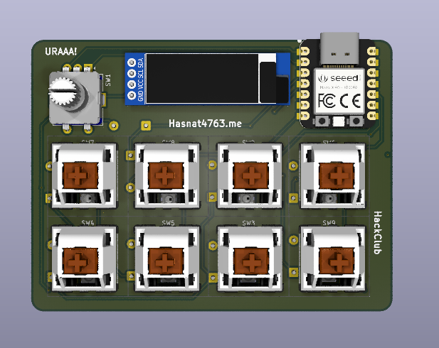

# Commiepad V2

A fully custom designed macro pad.

## Parts used:  
- SEEED XIAO RP 2040 with custom KMK firmware 
- 8 Cherry MX switches
- EC 11 encoder
- SSD1306 OLED
- Custom desktop app to control underglow and OLED

## Gallery

# PCB

# CAD

# Zine Poster

# BOM (Work in progress)

| Name  	            | Quantity   	    | Price  	| Source  	|   	|
|SEEED XIAO RP2040	    | 1  	            | 4.84$	    |[\[Aliexpress\]()](https://www.aliexpress.com/item/1005003275643720.html?spm=a2g0o.productlist.main.1.6c79cnCBcnCBmD&algo_pvid=965580c8-c959-4357-9a59-2691b567242c&pdp_ext_f=%7B%22order%22%3A%2225%22%2C%22eval%22%3A%221%22%2C%22fromPage%22%3A%22search%22%7D&utparam-url=scene%3Asearch%7Cquery_from%3A%7Cx_object_id%3A1005003275643720%7C_p_origin_prod%3A)	    |---	|
|   	    |   	            |   	    |   	    |   	|
|   	    |   	            |   	    |   	    |   	|
|   	    |   	            |   	    |   	    |   	|