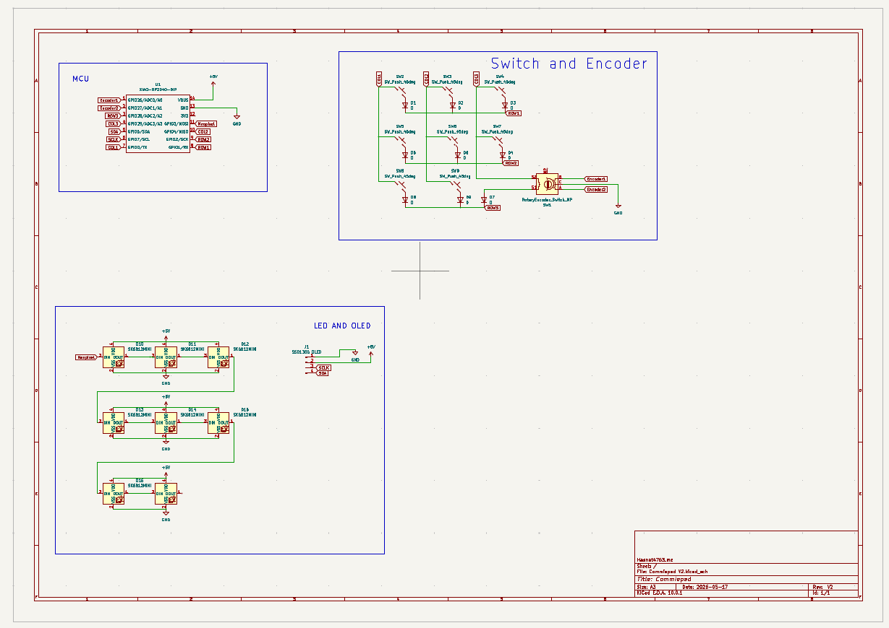
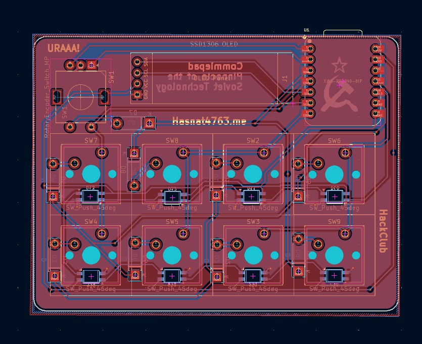
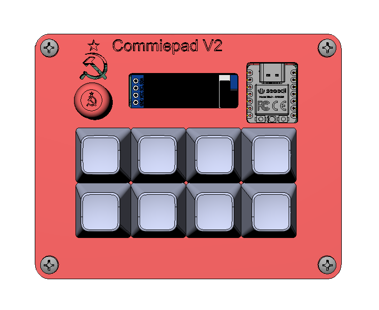
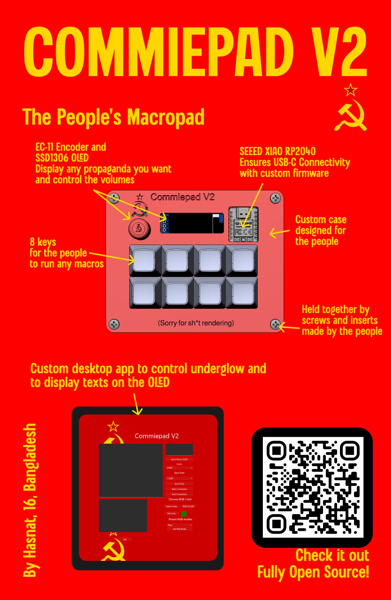
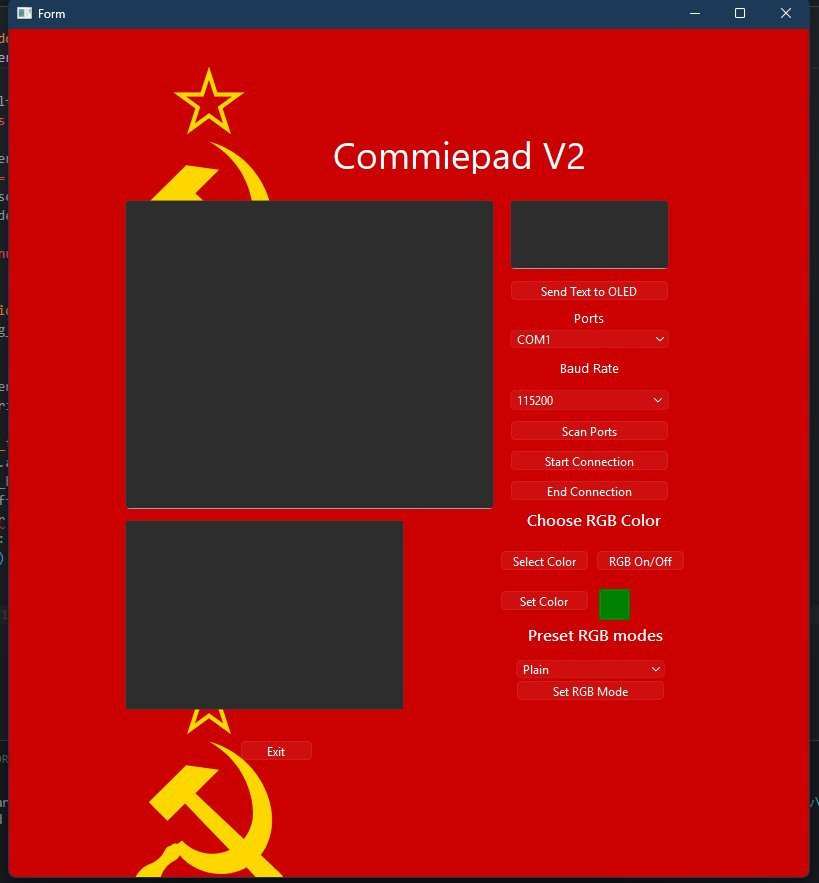

# Commiepad V2

A fully custom designed macro pad.
It is a sequel to my 1st macropad design [Commiepad](https://github.com/Hasnat4763/CommiePad). The 1st one was not working fully as I had made some mistakes in the PCB by not using a matrix and combining OLED SDA with neopixel data line. So I fixed that mistake in this one. It can be used for running macros which can help people like programmers and designers to run commands they need to run a lot just by clicking one key instead of multiple.

## Parts used:  
- SEEED XIAO RP 2040 with custom KMK firmware 
- 8 Cherry MX switches
- EC 11 encoder
- SSD1306 OLED
- Custom desktop app to control underglow and OLED

## Gallery

# PCB

Schematic

PCB

PCB Rendered

# CAD

Full Board Assembled

Bottom Part

Top Cover

# Zine Poster

# BOM

| Item                                             | Quantity | Price          | Link |
|--------------------------------------------------|----------|----------------|------|
| SEEED XIAO RP2040 (THT)                          | 1        | $$7.25          | [Link](https://www.seeedstudio.com/XIAO-RP2040-v1-0-p-5026.html) |
| Outemu Silent Peach V3 Switch                              | 10      | $6.09          | [Link](https://www.aliexpress.com/item/1005006905361113.html) |
| SK6812-MINI-E (RGB LEDs)                         | 20      | $5.26         | [Link](https://www.aliexpress.com/item/1005005193716172.html) |
| 1N4148 Diode                                     | 100      | $1.20          | [Link](https://www.aliexpress.com/item/4000142272546.html) |
| SSD1306 OLED Display                             | 1        | $5.15           | [Link](https://www.aliexpress.com/item/1005008640132638.html) |
| YMDK Blank DSA 1u Keycap                         | 10       | $6.43          | [Link](https://www.aliexpress.com/item/32842379355.html) |
| EC 11 Encoder with Push Button Half Handle 20MM Shaft | 5 | $6.31 | [Link](https://www.aliexpress.com/item/1005005983134515.html) |
| Top Case                                         | 1        | Printing Legion |  |
| Bottom Case                                      | 1        | Printing Legion |  |
| PCB | 5 | $11.02 | JLCPCB |

# Instructions

To print the PCB, use any PCB fabricators you can find for cheap, for most people it's JLCPCB. But then you also have to check the shipping cost and customs of your country.
For the parts, aliexpress works. But then you can also get them from your local suppliers too.

# Flashing the firmware

First, follow the [KMK starter guide](https://github.com/KMKfw/kmk_firmware/blob/main/docs/en/Getting_Started.md) to flash KMK on your microcontroller, My repository already has the KMK files necessary with all the extra libraries for the SSD1306 OLED, so you can follow the KMK starter guide but remember to copy the files from this repository instead of the KMK one. Remember to copy the [serialcommand.py](https://github.com/Hasnat4763/Commiepad-V2/blob/c52ac5da764008b54e5d9a0160083da586aadd7f/Commiepad%20V2%20Firmware%20KMK/serialcommand.py) else you won't be able to use the desktop app to control the RGB underglow. You can change the keys you want the macro pad to press on the [main.py](https://github.com/Hasnat4763/Commiepad-V2/blob/aac4e51710a858434e91d4a1d5ed2a7157012af6/Commiepad%20V2%20Firmware%20KMK/main.py), as I have just put some placeholder keys like A, B, C, D etc. for now. You may even make layers so one key can be used to trigger multiple keys!

# Using the desktop app

the desktop app looks like this 

After launching the app, select the COM port your Macropad is connected to, and select the baud rate (Most popular option is 115200), after that click the button called "Start Connection". After successful connection, the debug area will show a message about it. Then you can start controlling the RGB and also put text on the OLED from it.

Features of this app:
- Can turn underglow on/off
- Set custom color to it
- Set RGB mode to KMK presets
- Set any text to the OLED

I may add some more features to it later. For now these should work (They haven't been tested yet).
