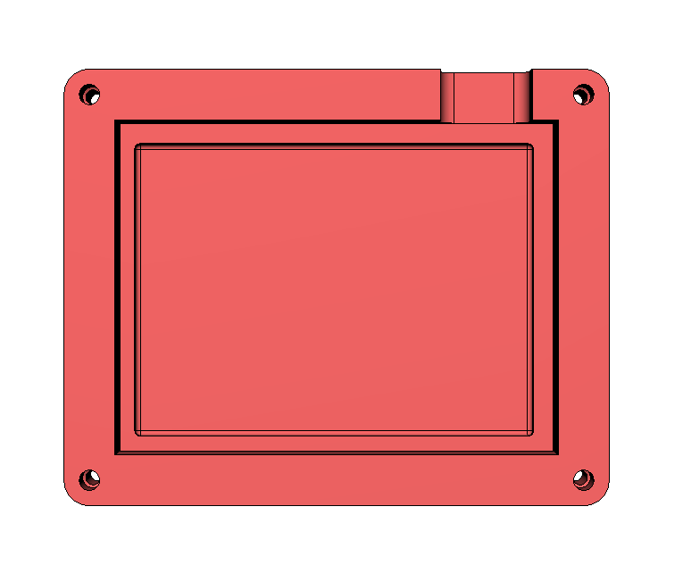
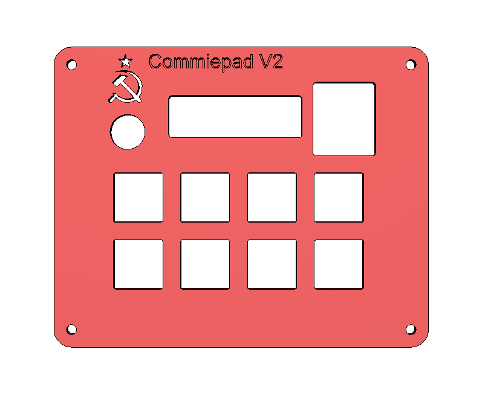

# Commiepad V2

A fully custom designed macro pad.

## Parts used:  
- SEEED XIAO RP 2040 with custom KMK firmware 
- 8 Cherry MX switches
- EC 11 encoder
- SSD1306 OLED
- Custom desktop app to control underglow and OLED

## Gallery

# PCB

# CAD

# Zine Poster

# BOM (Work in progress)